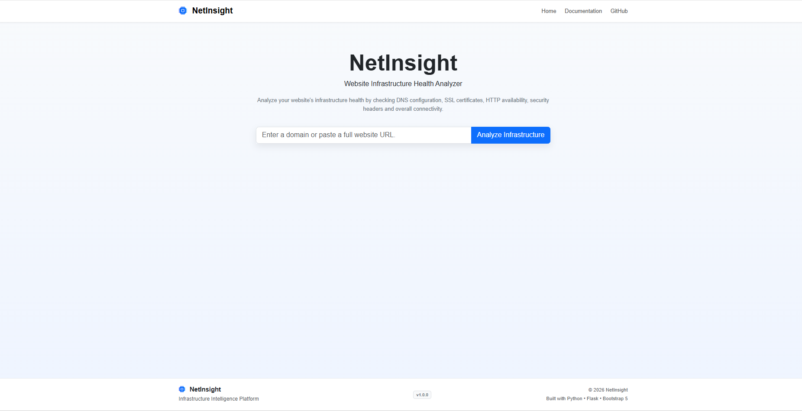
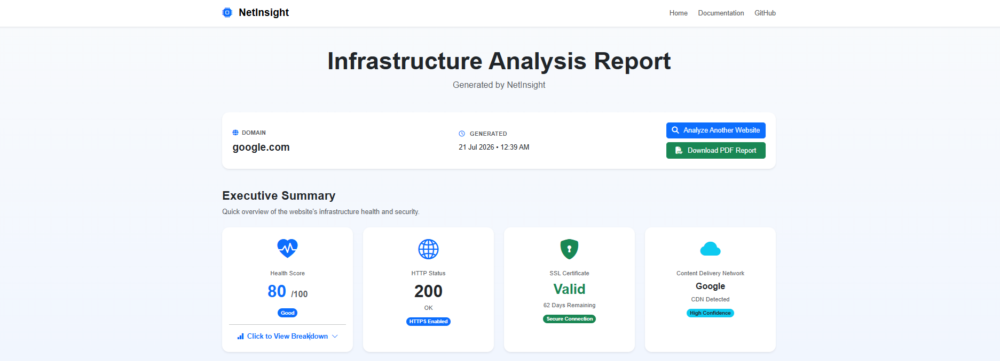
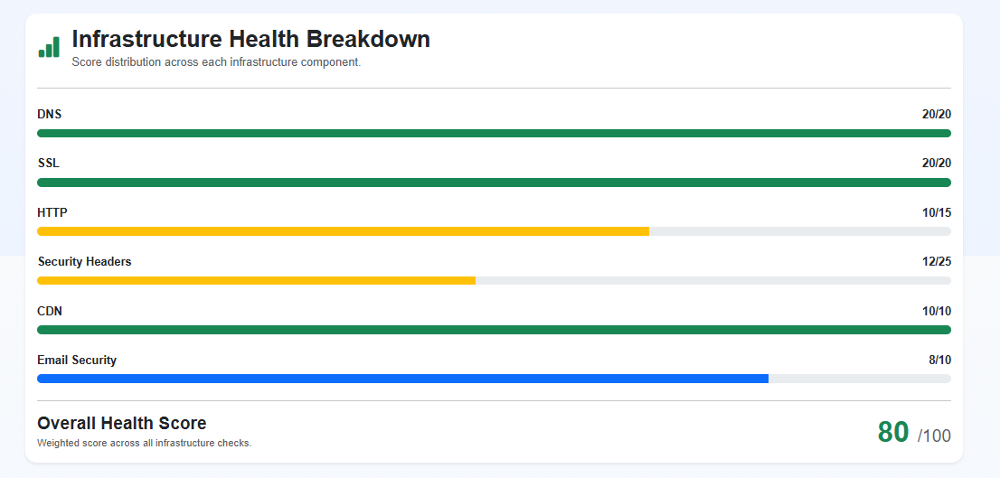
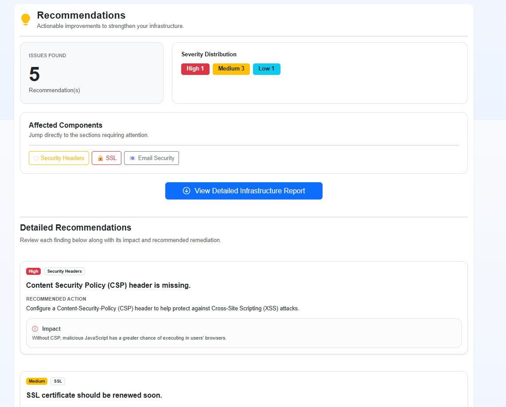
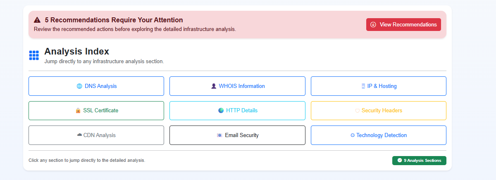
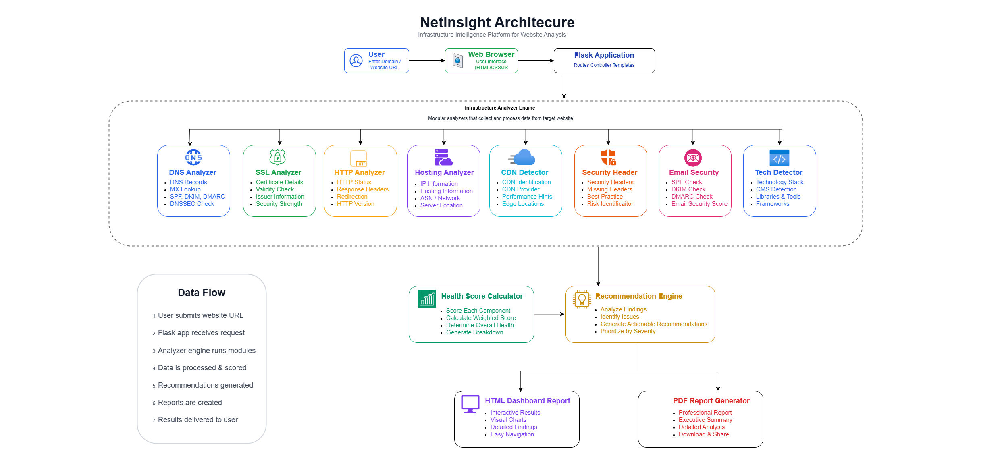

# 🌐 NetInsight

> **A Flask-based website infrastructure analysis tool that evaluates DNS, SSL/TLS, HTTP, CDN, email security, hosting, technologies, and overall infrastructure health.**

NetInsight helps developers, system administrators, and security professionals quickly analyze a website's infrastructure and generate a professional HTML dashboard and downloadable PDF report with actionable recommendations.

---

# 🌐 Live Demo

🔗 https://netinsight-zh9s.onrender.com

## 📸 Screenshots

### Landing Page



---

### Executive Summary



---

### Infrastructure Health



---

### Recommendations



---

### Analysis Index



---

## 🏗️ System Architecture



NetInsight performs infrastructure analysis using independent analyzer modules coordinated by a central analysis engine. Results are aggregated, scored, and presented in both an interactive dashboard and a downloadable PDF report.

---

# ✨ Features

- 🌍 DNS Analysis
  - A, AAAA, MX, TXT, NS, CNAME records
  - DNSSEC detection

- 🔒 SSL/TLS Analysis
  - Certificate issuer
  - Expiration date
  - Cipher suite
  - TLS version

- 🌐 HTTP Analysis
  - Status code
  - Redirect chain
  - Response headers
  - Server information

- 🛡️ Security Headers
  - HSTS
  - CSP
  - X-Frame-Options
  - X-Content-Type-Options
  - Referrer-Policy
  - Permissions-Policy
  - Cross-Origin policies

- ☁️ CDN Detection
  - Cloudflare
  - Akamai
  - Fastly
  - Amazon CloudFront
  - Azure CDN
  - Google Cloud CDN
  - and more...

- 📧 Email Security
  - SPF
  - DKIM
  - DMARC
  - MX validation

- 🌐 IP & Hosting Analysis
  - IP lookup
  - Hosting provider
  - ASN
  - Reverse DNS

- 🛠 Technology Detection
  - Web server
  - Frameworks
  - CMS
  - Programming language
  - JavaScript libraries

- 📊 Infrastructure Health Score

- 💡 Intelligent Recommendation Engine

- 📄 Professional PDF Report Generation

---

# ⚙️ Technology Stack

## Backend

- Python 3
- Flask
- Flask-Session

## Frontend

- HTML5
- Bootstrap 5
- JavaScript

## Libraries

- Requests
- BeautifulSoup
- dnspython
- SSL
- Socket
- ReportLab
- ThreadPoolExecutor

---

# 📂 Project Structure

```
NetInsight/
│
├── app.py
├── analyzer.py
├── requirements.txt
├── README.md
│
├── services/
│   ├── dns_analyzer.py
│   ├── ssl_analyzer.py
│   ├── http_analyzer.py
│   ├── technology_analyzer.py
│   ├── security_headers.py
│   ├── cdn_analyzer.py
│   ├── email_security.py
│   ├── hosting.py
│   ├── health_score.py
│   └── recommendation_engine.py
│
├── templates/
├── static/
├── docs/
│   └── images/
└── tests/
```

---

# 🔄 Analysis Workflow

```
User URL
    │
    ▼
Infrastructure Analyzer
    │
    ├── DNS
    ├── SSL
    ├── HTTP
    ├── Security Headers
    ├── CDN
    ├── Email Security
    ├── Hosting
    └── Technology Detection
            │
            ▼
Infrastructure Health Score
            │
            ▼
Recommendation Engine
            │
            ▼
HTML Dashboard + PDF Report
```

---

# 🚀 Installation

Clone the repository

```bash
git clone https://github.com/kamendrasingh-chahar/NetInsight.git
```

Go to the project directory

```bash
cd NetInsight
```

Create a virtual environment

```bash
python -m venv .venv
```

Activate the environment

### Windows

```bash
.venv\Scripts\activate
```

### Linux / macOS

```bash
source .venv/bin/activate
```

Install dependencies

```bash
pip install -r requirements.txt
```

Run the application

```bash
python app.py
```

Open

```
http://127.0.0.1:5000
```

---

# 📊 Infrastructure Health Scoring

The overall health score is calculated using weighted analysis modules.

| Module | Weight |
|---------|---------:|
| DNS | 20% |
| SSL/TLS | 20% |
| HTTP | 15% |
| Security Headers | 25% |
| CDN | 10% |
| Email Security | 10% |

---

# 💡 Recommendation Engine

NetInsight automatically generates recommendations based on detected issues, including:

- Missing security headers
- Weak SSL configuration
- Missing SPF/DKIM/DMARC
- DNS configuration problems
- HTTP configuration improvements
- Infrastructure best practices

Recommendations are categorized by priority to help users focus on the most impactful improvements.

---

# 🛣️ Future Enhancements

- User authentication
- Historical scan reports
- Scheduled website monitoring
- REST API
- Export to JSON
- Dashboard analytics
- Additional technology detection
- Performance metrics
- Docker support

---

# 🤝 Contributing

Contributions, suggestions, and bug reports are welcome.

1. Fork the repository
2. Create a feature branch
3. Commit your changes
4. Open a Pull Request

---

# 📄 License

This project is licensed under the MIT License.

---

# 👨‍💻 Author

**Kamendrasingh Chahar**

- GitHub: https://github.com/kamendrasingh-chahar

If you found this project helpful, consider giving it a ⭐ on GitHub.
